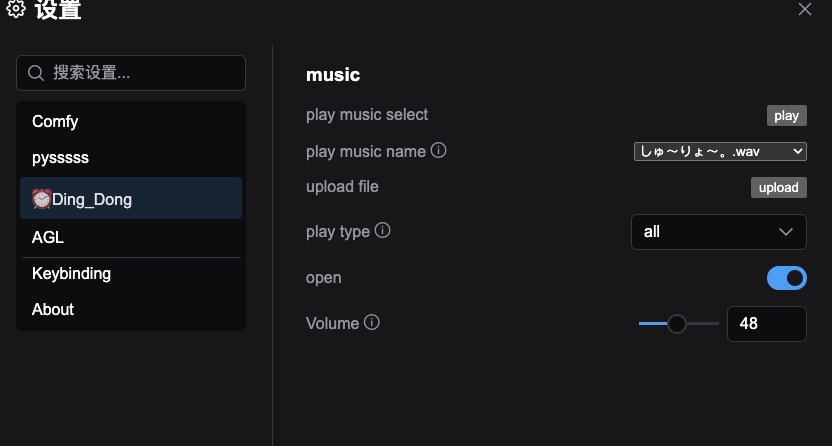
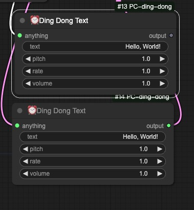

# ⏰ ComfyUI Workflow Notification Plugin 
[中文版](./readme.zh.md)


Just like when your pizza is ready and the oven goes "Ding! 🍕", this plugin lets your ComfyUI notify you when your AI creations are done baking! 

A ComfyUI custom node that sends you a friendly "ding-dong" notification when your workflows are fully cooked and ready to serve. No more staring at the screen waiting - let the AI kitchen tell you when dinner's ready! 👨‍🍳

```HTML
<video width="320" height="240" controls>
    <source src="./image/demo.mp4" type="video/mp4">
</video>
```

## Features 🌟

- Get notified when tasks complete
- Save cloud and local computing resources
- Perfect for long-running workflows and batch processing
- Free up your time - no need to watch the screen
- Improve workflow efficiency with timely alerts




- Sound notifications when workflows complete
- Adjustable notification volume 
- Sound toggle control
- Support for single workflow or batch workflow completion notifications
- Support for custom notification sound upload
- Save cloud and local computing resources
- Perfect for long-running workflows and batch processing
- Free up your time - no need to watch the screen
- Improve workflow efficiency with timely alerts

## Nodes

### DingDong Node


A notification node that plays a custom sound file when workflow execution reaches it. You can select your own audio file and adjust the volume to get notified exactly how you want.

### DingDongText Node



A text-to-speech notification node that speaks custom text when workflow execution reaches it. The speech can be customized with adjustable pitch, speed and volume settings.


## Installation

1. Download the node files
2. Place in ComfyUI's `custom_nodes` folder
3. Restart ComfyUI
