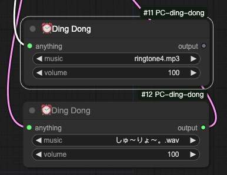
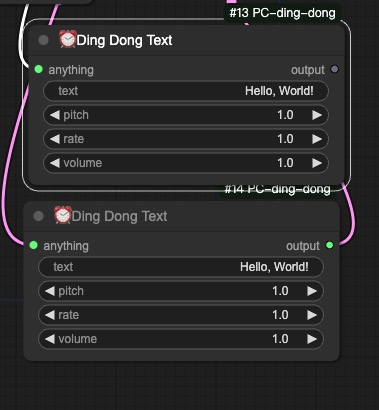

# ⏰ ComfyUI 工作流通知插件

就像当披萨烤好时烤箱会发出"叮！🍕"的提示音一样，这个插件可以在你的 AI 创作完成时通知你！

这是一个 ComfyUI 自定义节点，当你的工作流程完成时会发送友好的"叮咚"通知。不用再盯着屏幕等待 - 让 AI 厨房告诉你作品什么时候准备好！👨‍🍳

## 功能特点 🌟

- 任务完成时获得通知
- 节省云端和本地计算资源
- 完美适用于长时间运行的工作流和批量处理
- 释放你的时间 - 无需盯着屏幕
- 通过及时提醒提高工作流效率

- 工作流完成时的声音通知
- 可调节的通知音量
- 声音开关控制
- 支持单个工作流或批量工作流完成通知
- 支持自定义通知音效上传

## 节点

### DingDong 节点

一个通知节点，当工作流执行到该节点时会播放自定义音效。你可以选择自己的音频文件并调节音量，获得你想要的通知方式。

### DingDongText 节点

一个文字转语音的通知节点，当工作流执行到该节点时会朗读自定义文本。语音可以通过调节音调、速度和音量来自定义。

## 安装方法

1. 下载节点文件
2. 放置在 ComfyUI 的 `custom_nodes` 文件夹中
3. 重启 ComfyUI
